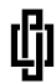
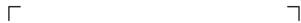
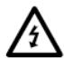

<table><tr><td colspan="2">TEST REPORTIEC/EN 62109-1Safety of Power Converter for use in Photovoltaic Power SystemsPart 1: General requirements</td></tr><tr><td>Report Number. ......:</td><td>GZES230100125901</td></tr><tr><td>Date of issue......:</td><td>2023-02-01</td></tr><tr><td>Total number of pages......:</td><td>72</td></tr><tr><td>Name of Testing Laboratorypreparing the Report......:</td><td>SGS-CSTC Standards Technical ServBranch</td></tr><tr><td>Applicant's name......:</td><td>Zhejiang CHISAGE New Energy Technology Co., Ltd</td></tr><tr><td>Address......:</td><td>No. 1828 Fuqing South RD. Panhuo ST. Yinzhou District NingboZhejiang 315000 China</td></tr><tr><td colspan="2">Test specification:</td></tr><tr><td>Standard......:</td><td>EN 62109-1:2010IEC 62109-1:2010 (First Edition)</td></tr><tr><td>Test procedure......:</td><td>SGS-CSTC</td></tr><tr><td>Non-standard test method......:</td><td>N/A</td></tr><tr><td>Test Report Form No......:</td><td>IEC62109_1B</td></tr><tr><td>Test Report Form(s) Originator......:</td><td>VDE Testing and Certification Institute</td></tr><tr><td>Master TRF......:</td><td>Dated 2016-04</td></tr><tr><td colspan="2">Copyright © 2016 IEC System of Conformity Assessment Schemes for Electrotechnical Equipmentand Components (IECEE System). All rights reserved.This publication may be reproduced in whole or in part for non-commercial purposes as long as the IECEE is acknowledged ascopyright owner and source of the material. IECEE takes no responsibility for and will not assume liability for damages resulting fromthe reader's interpretation of the reproduced material due to its placement and context.This report is not valid as a CB Test Report unless signed by an approved CB Testing Laboratoryand appended to a CB Test Certificate issued by an NCB in accordance with IECEE 02.</td></tr><tr><td colspan="2">General disclaimer:</td></tr><tr><td colspan="2">The test results presented in this report relate only to the object tested.This report shall not be reproduced, except in full, without the written approval of the Issuing CB TestingLaboratory. The authenticity of this Test Report and its contents can be verified by contacting the NCB,responsible for this Test Report.</td></tr><tr><td>Test item description ......:Trade Mark ......:</td><td>Single phase inverterCHISAGE</td></tr><tr><td>Manufacturer......:Address ......:</td><td>Zhejiang CHISAGE New Energy Technology Co., LtdNo. 1828 Fuqing South RD. Panhuo ST. Yinzhou District Ningbo Zhejiang 315000 China</td></tr><tr><td>Model/Type reference......:Ratings ......:</td><td>See model list in page 7See model list in Page 7 to 8.Hardware version: Ver2.3DC Software version: Ver0107AC Software version: Ver2.5</td></tr></table>

<table><tr><td colspan="4">Responsible Testing Laboratory (as applicable), testing procedure and testing location(s):</td></tr><tr><td colspan="4"></td></tr><tr><td>☒</td><td>Testing Laboratory:</td><td colspan="2">SGS-CSTC Standards Technical Services Co., Ltd.Guangzhou Branch</td></tr><tr><td colspan="2">Location/ address ......:</td><td colspan="2">198 Kezhu Road, Science City, Economic &amp; Technology Development Area, Guangzhou, Guangdong, China</td></tr><tr><td colspan="2">Tested by (name, function, signature) ......:</td><td>Doris Tao(Project Engineer)</td><td>Doris Tao</td></tr><tr><td colspan="2">Approved by (name, function, signature ....:</td><td>Roger Hu(Technical Reviewer)</td><td>Zengma</td></tr><tr><td colspan="4"></td></tr><tr><td colspan="4">List of Attachments (including a total number of pages in each attachment): 63 Page ~72 Page</td></tr><tr><td colspan="4">Summary of testing:</td></tr><tr><td>Tests performed (name of test and test clause):The equipment has been tested according to the standard: EN 62109-1:2010 and IEC 62109-1:2010.All test results are from the original report GZES210602035101, issued by SGS-CTS Standards Technical Services Co., Ltd Guangzhou Branch.</td><td colspan="3">Testing location:See page 2</td></tr><tr><td colspan="4">Summary of compliance with National Differences (List of countries addressed):No National Differences are addressed to this test report</td></tr></table>

## Copy of marking plate(representative):

## Utility-Interactive Inverter

Maximum input Voltage: 60Vdc

Range of input operating voltage: 25\~55Vdc

Maximum input current: 13A x 4

Operating voltage range (AC): 230Vac

Rated output current(AC): 8.7A

Max output apparent power: 2000VA

Rated output power: 2000W

Rated AC Grid Frequency: 50/60Hz

Ambient Temperature: $-40^{\circ}C \sim +65^{\circ}C$

Peak efficiency: 96.5%

Protective class: Class I

Ingress protection: IP67

Max.Units per branch: 3

  
CHISAGE

## Type: CE-1P20001G-230-EU

Number Serial:

-Both AC and DC voltage sources are terminated inside this equipment

-Each circuit must be individually disconnected before servicing

-Photovoltaic array supplied a DC voltage to this equipment when exposed to light

-Hot surface: To reduce the risk of burn - Do not touch

-Raintight enclosure: IP67

-To be connected to a dedicated branch circuit

-Maximum Branch circuit overcurrent protection: 45A

www.chisagess.com

## Note:

1. The above markings are the minimum requirements required by the safety standard. For the final production samples, the additional markings which do not give rise to misunderstanding may be added.  
2. Label is attached on the side surface of enclosure and visible after installation  
3. Labels of other models are as the same with CE-1P20001G-230-EU's except the parameters of rating.  
4. As declared by the applicant, the importer (and manufacturer, if it is different)'s name, registered trade name or registered trademark and the postal address will be marked on the products before being place on the market. The contact details shall be in a language easily understood by end-users and market surveillance authorities.

<table><tr><td>Test item particulars....:</td><td colspan="4">Single Phase Inverter</td></tr><tr><td>Equipment mobility....:</td><td>□ movable ☒ fixed</td><td>□ hand-held □ transportable</td><td colspan="2">□ stationary □ for building-in</td></tr><tr><td>Connection to the mains....:</td><td colspan="2">□ pluggable equipment ☒ permanent connection</td><td colspan="2">□ direct plug-in □ for building-in</td></tr><tr><td>Environmental category....:</td><td>☒ outdoor</td><td colspan="2">□ indoor unconditional</td><td>□ indoor conditional</td></tr><tr><td>Over voltage category Mains....:</td><td>□ OVC I</td><td>□ OVC II</td><td>☒ OVC III</td><td>□ OVC IV</td></tr><tr><td>Over voltage category PV....:</td><td>□ OVC I</td><td>☒ OVC II</td><td>□ OVC III</td><td>□ OVC IV</td></tr><tr><td>Mains supply tolerance (%)....:</td><td colspan="4">-90 / +110 %</td></tr><tr><td>Tested for power systems....:</td><td colspan="4">TN systems</td></tr><tr><td>IT testing, phase-phase voltage (V)....:</td><td colspan="4">N/A</td></tr><tr><td>Class of equipment....:</td><td colspan="4">☒ Class I □ Class II □ Not classified</td></tr><tr><td>Mass of equipment (kg)....:</td><td colspan="4">3,5 kg for all model</td></tr><tr><td>Pollution degree....:</td><td colspan="4">Outside PD3; Inside PD2</td></tr><tr><td>IP protection class....:</td><td colspan="4">IP 67</td></tr><tr><td colspan="5">Possible test case verdicts:</td></tr><tr><td>- test case does not apply to the test object....:</td><td colspan="4">N/A</td></tr><tr><td>- test object does meet the requirement....:</td><td colspan="4">P (Pass)</td></tr><tr><td>- test object was not evaluated for the requirement....:</td><td colspan="4">N/E</td></tr><tr><td>- test object does not meet the requirement....:</td><td colspan="4">F (Fail)</td></tr><tr><td colspan="5">Testing....:</td></tr><tr><td>Date of receipt of test item....:</td><td colspan="4">N/A</td></tr><tr><td>Date (s) of performance of tests....:</td><td colspan="4">2020-09-06 to 2020-09-28</td></tr></table>

## General remarks:

"(See Enclosure #)" refers to additional information appended to the report. "(See appended table)" refers to a table appended to the report.

This document is issued by the Company subject to its General Conditions of Service printed overleaf, available on request or accessible at www.sgs.com/terms\_and\_conditions.htm and, for electronic format documents, subject to Terms and Conditions for Electronic Documents at www.sgs.com/terms\_e-document.htm. Attention is drawn to the limitation of liability, indemnification and jurisdiction issues defined therein. Any holder of this document is advised that information contained hereon reflects the Company's findings at the time of its intervention only and within the limits of Client's instructions, if any. The Company's sole responsibility is to its Client and this document does not exonerate parties to a transaction from exercising all their rights and obligations under the transaction documents. This document cannot be reproduced except in full, without prior written approval of the Company. Any unauthorized alteration, forgery or falsification of the content or appearance of this document is unlawful and offenders may be prosecuted to the fullest extent of the law. Unless otherwise stated the results shown in this test report refer only to the sample(s) tested.

Throughout this report a ☒ comma / □ point is used as the decimal separator.

## Manufacturer's Declaration per sub-clause 4.2.5 of IECEE 02:

The application for obtaining a CB Test Certificate includes more than one factory location and a declaration from the Manufacturer stating that the sample(s) submitted for evaluation is (are) representative of the products from each factory has been provided....

□ Yes  
☒ Not applicable

When differences exist; they shall be identified in the General product information section.

Name and address of factory (ies)....:

NingBo Deye Inverter Technology Co., Ltd.
No.26 South YongJiang Road, Daqi, Beilun, NingBo, China.

## General product information:

Product covered by this report is grid-connected PV inverter for indoor or outdoor installation. The connection to the DC input and AC output are through connectors.

The Solar inverter converts DC voltage into AC voltage.

The input and output are protected by varistors to Earth. The unit is providing EMC filtering at the output toward mains. The unit does not provide galvanic separation from input to output (transformerless). The output is switched off redundant by the high-power switching bridge and two relays. This assures that the opening of the output circuit can operate in case of single fault.

## Equipment Under Testing:

CE-1P3001G-230-EU, CE-1P5001G-230-EU, CE-1P6001G-230-EU, CE-1P8001G-230-EU, CE-1P10001G-230-EU, CE-1P13001G-230-EU, CE-1P16001G-230-EU, CE-1P18001G-230-EU, CE-1P20001G-230-EU(1)

(1) Except for 4.2.2.6 TABLE: mains supply electrical data in normal condition is All models test, the other test clause model is CE-1P20001G-230-EU.

<table><tr><td>Model Number</td><td>CE-1P3001G-230-EU</td><td>CE-1P5001G-230-EU</td><td>CE-1P6001G-230-EU</td><td>CE-1P8001G-230-EU</td><td>CE-1P10001G-230-EU</td></tr><tr><td colspan="6">Input (DC)</td></tr><tr><td>Max. input power</td><td>400W</td><td>600W</td><td>800W</td><td>1200W</td><td>1200W</td></tr><tr><td>Max. input voltage</td><td colspan="5">60V</td></tr><tr><td>MPPT voltage range</td><td colspan="5">25~55V</td></tr><tr><td>Max. input current</td><td>13A</td><td>13A</td><td>13A×2</td><td>13A×2</td><td>13A×2</td></tr><tr><td colspan="6">Output (AC)</td></tr><tr><td>Rated grid voltage</td><td colspan="5">230V</td></tr><tr><td>Rated grid frequency</td><td colspan="5">50Hz</td></tr><tr><td>Rated output power</td><td>300W</td><td>500W</td><td>600W</td><td>800W</td><td>1000W</td></tr><tr><td>Rated output current</td><td>1.3A</td><td>2.2A</td><td>2.6A</td><td>3.8A</td><td>4.8A</td></tr><tr><td>Power factor</td><td colspan="5">&gt;0.99</td></tr><tr><td>Ambient temperature</td><td colspan="5">-40 °C ~ 65 °C</td></tr><tr><td>Ingress protection</td><td colspan="5">IP67</td></tr><tr><td>Protective class</td><td colspan="5">Class I</td></tr></table>

<table><tr><td>Model Number</td><td>CE-1P13001G-230-EU</td><td>CE-1P16001G-230-EU</td><td>CE-1P18001G-230-EU</td><td>CE-1P20001G-230-EU</td></tr><tr><td colspan="5">Input (DC)</td></tr><tr><td>Max. input power</td><td>1600W</td><td>2400W</td><td>2400W</td><td>2400W</td></tr><tr><td>Max. input voltage</td><td colspan="4">60V</td></tr><tr><td>MPPT voltage range</td><td colspan="4">25~55V</td></tr><tr><td>Max. input current</td><td>13A×4</td><td>13A×4</td><td>13A×4</td><td>13A×4</td></tr><tr><td colspan="5">Output (AC)</td></tr><tr><td>Rated grid voltage</td><td colspan="4">230V</td></tr><tr><td>Rated grid frequency</td><td colspan="4">50Hz</td></tr><tr><td>Rated output power</td><td>1300W</td><td>1600W</td><td>1800W</td><td>2000W</td></tr><tr><td>Rated output current</td><td>6.2A</td><td>7.7A</td><td>8.6A</td><td>9.6A</td></tr><tr><td>Power factor</td><td colspan="4">&gt;0.99</td></tr><tr><td>Ambient temperature</td><td colspan="4">-40 °C ~65 °C</td></tr><tr><td>Ingress protection</td><td colspan="4">IP67</td></tr><tr><td>Protective class</td><td colspan="4">Class I</td></tr></table>